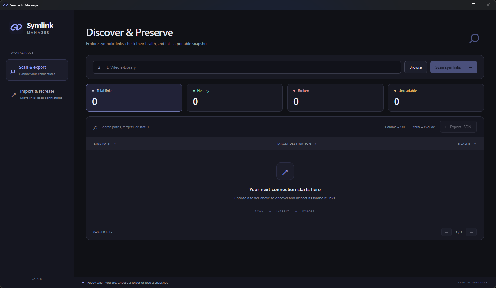
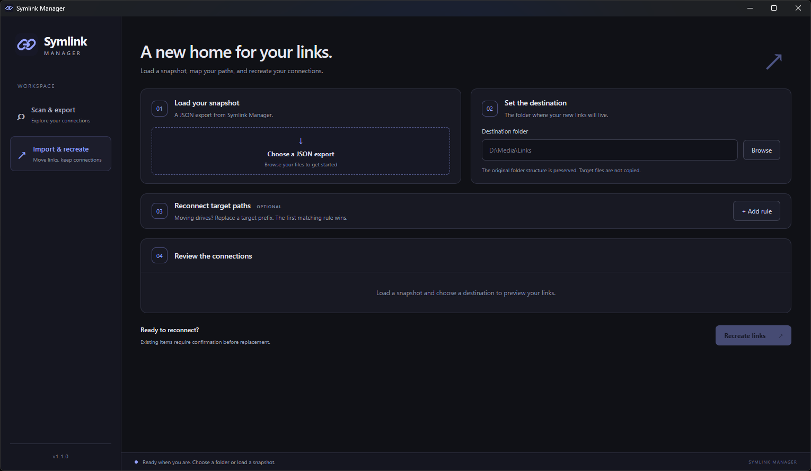

<p align="center">
  
</p>

<h1 align="center">Symlink Manager</h1>

<p align="center">Discover, preserve, and reconnect symbolic links.</p>

Symlink Manager is a portable desktop app for scanning, exporting, and recreating symbolic links when a library moves, drives change, or a machine is rebuilt. It preserves link locations and targets—it never copies the target files.



## Scan, inspect, export

Choose a folder to discover its symbolic links and verify each target. **Healthy** links are accessible, **Broken** targets are missing, and **Unreadable** links or targets could not be verified. A separate skipped count reports traversal errors.

Filter by health, search paths, targets, or status, and browse the compact 100-row pages. Search supports comma-separated OR terms and `-term` exclusions. **Export JSON** saves every matching result, across all pages, as a portable snapshot.

Scanning runs off the UI thread with bounded concurrency, keeping the app responsive for large libraries.

## Import and recreate

Load an export, choose the new link destination, then review the automatically updated preview. Optional root mappings reconnect moved targets—for example, `W:\Shows` to `/mnt/media/shows`; the first matching rule wins.

Imported paths and destinations are validated before work begins. Existing items require confirmation, are preserved temporarily during replacement, and are restored if link creation fails. Non-empty real directories are never replaced.

<p align="center">
  
</p>

## Portable on Windows and Linux

The app is built with **Tauri, Svelte, and Rust** and processes data locally. Windows may require Developer Mode or administrator elevation to create links. Linux is supported by the implementation, but full native validation of the current refactor is still pending; normal write and executable permissions apply. macOS is not tested.

## Develop

Install Node.js/npm, Rust, and the [Tauri prerequisites](https://v2.tauri.app/start/prerequisites/) for your platform, then run:

```sh
npm ci
npm run tauri dev
```

Useful release checks and builds:

```sh
npm run check
npm run build
cargo test --manifest-path src-tauri/Cargo.toml --lib
npm run tauri build
```

See [CHANGELOG.md](CHANGELOG.md) for release history.

## License

MIT © 2026 Danavans. See [LICENSE](LICENSE).
